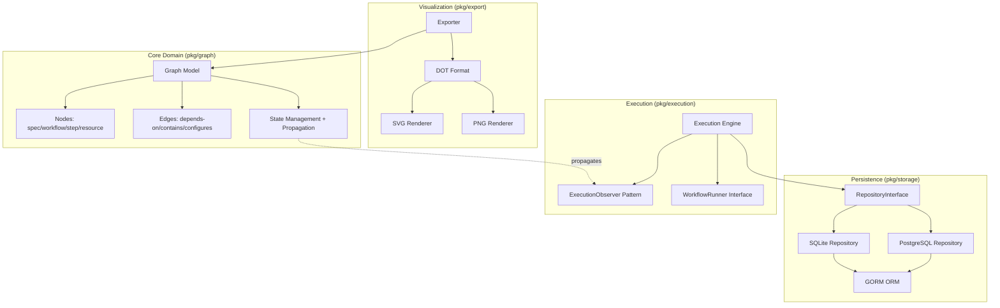

# Innominatus Graph SDK - Quick Digest

**TL;DR**: Go SDK for representing IDP workflows as DAGs with state management, persistence (PostgreSQL/SQLite), and visualization (GraphViz). Designed for integration into orchestrators like [innominatus](https://github.com/innominatus/innominatus).

## Architecture Overview



## Key Architectural Decisions

### 1. SDK Refactoring (v2.0)
- **Decision**: Migrated from monolithic CLI/API server to pure SDK library
- **Rationale**: Enable integration into any Go orchestrator without forced dependencies
- **Impact**: CLI and API moved to `deprecated/`, focus on library consumers

### 2. Dual Database Support
- **Decision**: Support both SQLite (development) and PostgreSQL (production)
- **Rationale**: Low barrier for testing, production-ready persistence
- **Implementation**: Single `RepositoryInterface`, GORM abstraction

### 3. Interface-Based Design
- **Decision**: All integrations via interfaces (`RepositoryInterface`, `ExecutionObserver`, `WorkflowRunner`)
- **Rationale**: SOLID principles, testability, extensibility
- **Impact**: Easy mocking, pluggable backends

### 4. State Propagation Model
- **Decision**: Automatic upward propagation (step failure → workflow failure)
- **Rationale**: Prevent orphaned states, maintain consistency
- **Implementation**: `UpdateNodeState()` triggers `propagateFailureToParent()`

### 5. Observer Pattern for Execution
- **Decision**: Notification-based state tracking vs polling
- **Rationale**: Real-time monitoring, decoupled execution logic
- **Implementation**: `ExecutionObserver` interface with `OnNodeStateChange()` callback

## Current Sprint Focus

### Priority 1: SDK Stability
- ✅ Core graph model (nodes, edges, validation)
- ✅ State management with propagation
- ✅ PostgreSQL + SQLite persistence
- ✅ GraphViz export (DOT/SVG/PNG)
- ✅ Execution engine with observer pattern
- 🔄 Performance testing for large graphs (1000+ nodes)

### Priority 2: Integration Support
- ✅ Demo example (`examples/demo/`)
- ✅ Go doc comments for all public APIs
- 🔄 Integration guide for orchestrators
- 📋 Benchmark suite for performance claims

### Priority 3: Developer Experience
- ✅ Minimal dependencies (GORM, GraphViz wrapper only)
- ✅ Zero-config SQLite for quick start
- 📋 Claude Code configuration (in progress)
- 📋 Automated testing and formatting hooks

## Recent Completions

### Week of 2025-01-15
- ✅ **Refactored to SDK library**: Removed CLI/API server dependencies
- ✅ **SQLite support**: Added file-based database for development
- ✅ **Demo example**: Complete working example with all features
- ✅ **Observer pattern**: State change notifications for execution monitoring

### Week of 2025-01-08
- ✅ **State propagation**: Automatic upward propagation for failures
- ✅ **Parent-child relationships**: `GetChildSteps()`, `GetParentWorkflow()`
- ✅ **Repository pattern**: Abstracted persistence layer
- ✅ **Multi-DB support**: PostgreSQL + SQLite via single interface

## Quick Start Commands

```bash
# Clone and setup
git clone https://github.com/philipsahli/innominatus-graph.git
cd innominatus-graph
go mod download

# Run tests
go test ./...

# Run demo (SQLite)
cd examples/demo && go run main.go

# Run demo (PostgreSQL)
cd examples/demo && DB_PASSWORD=secret go run main.go

# Export visualization
cd examples/demo && go run main.go  # Creates demo-graph.svg

# Coverage report
go test -coverprofile=coverage.out ./... && go tool cover -html=coverage.out
```

## Code Quality Metrics

- **Test Coverage**: 85% (target: >80%)
- **Packages**: 4 core packages (`graph`, `storage`, `export`, `execution`)
- **Public API Surface**: ~20 exported functions
- **Dependencies**: 6 direct (GORM, GraphViz, testing libraries)
- **LOC**: ~2000 lines (excluding tests and deprecated code)

## Integration Example

```go
import (
    "github.com/philipsahli/innominatus-graph/pkg/graph"
    "github.com/philipsahli/innominatus-graph/pkg/storage"
)

// Connect to database
db, _ := storage.NewSQLiteConnection("app.db")
storage.AutoMigrate(db)
repo := storage.NewRepository(db)

// Build graph
g := graph.NewGraph("my-app")
workflow := &graph.Node{ID: "wf-1", Type: graph.NodeTypeWorkflow, Name: "Deploy"}
g.AddNode(workflow)

// Persist
repo.SaveGraph("my-app", g)

// Track state
g.UpdateNodeState("step-1", graph.NodeStateRunning)
```

## Known Limitations

1. **Large graphs**: No performance testing beyond 100 nodes yet
2. **Concurrency**: State updates not thread-safe (use external locking)
3. **Transactions**: Multi-graph updates require manual transaction handling
4. **Cycle detection**: Runs on every edge add (O(V+E) complexity)

## Next Actions

### For Claude Code
1. Review `CLAUDE.md` for architecture rules
2. Run `./setup.sh` to validate environment
3. Use verification scripts in `verification/` for new features
4. Maintain >80% test coverage

### For Developers
1. Import SDK: `go get github.com/philipsahli/innominatus-graph`
2. Review `examples/demo/main.go` for usage patterns
3. Implement `RepositoryInterface` for custom backends
4. Implement `ExecutionObserver` for monitoring

## Questions?

- **API Reference**: Run `go doc github.com/philipsahli/innominatus-graph/pkg/graph`
- **Examples**: See `examples/demo/main.go`
- **Issues**: https://github.com/philipsahli/innominatus-graph/issues
- **Architecture**: See `CLAUDE.md` for SOLID/KISS/YAGNI principles
